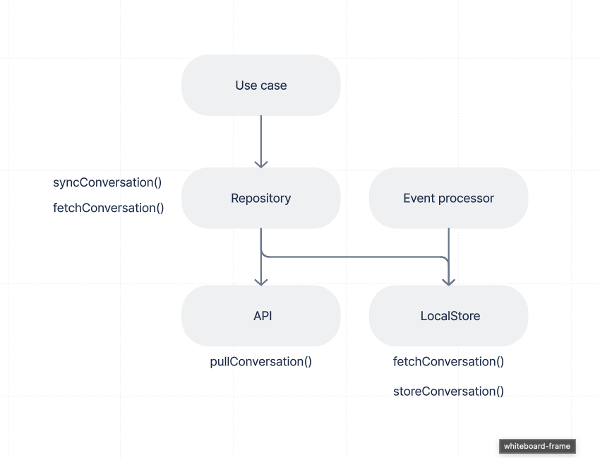

# ``WireDomain``

Domain layer containing business logic.

## Overview

The WireDomain framework provides the business logic components of the app: Repositories, Use cases or specific components related to Event Processing.

It depends on WireAPI and for the time being other older frameworks like WireDataModel and WireTransport.

> Note: In order to make it work with the old stack (WireSyncEngine...), it has been created as a Xcode project producing a framework. Once the old stack is replaced it could become a Swift Package.

## Architecture

The clean architecture, implemented in WireDomain, emphasizes the separation of responsibilities into well-defined layers:

- **Use Case**: This layer defines the core business logic of the app. Each use case represents a specific functionality or process, orchestrating how data flows through the system. The use cases are unaware of the details of data sources (like local or remote storage). They simply define what needs to happen and rely on abstract interfaces to perform these tasks.

  - **Example**: A `FetchUserUseCase` might fetch a user's profile, regardless of whether it's coming from a local database or an API. It ensures the app’s rules are followed but doesn't handle the data retrieval directly.

- **Repository**: Repositories act as a mediator between the use cases and data sources. They abstract the details of where data comes from whether it's the API layer or the local store. Repositories provide the use cases with a clean interface to access or manipulate data, keeping the use cases decoupled from the underlying data sources.

  - **Example**: A `UserRepository` might provide methods like `fetchUser()` or `pullUsers()`, hiding whether it gets the data from a local store or API. 

- **LocalStore (Data persistence layer)**: The `LocalStore` handles persistent storage, involving CoreData (for now we use the context directly however there should be a CoreData stack in the future). It is responsible for saving and retrieving data from local storage and can be used by the repository or the event processors to manipulate `CoreData` managed objects.

  - **Example**: A `UserLocalStore` might implement logic for updating user data locally and persisting these changes to the database.

- **API Layer (Remote data source)**: This layer handles communication with the Wire RESTful API. It is responsible for making network requests and returning data to the repository layer. The API layer is often called when performing a slow sync (`pullUsers()`) to get the database initially up-to-date or more generally when a synchronization is required.

  - **Example**: The `UsersAPI` might implement a network request to get a specific user from the backend and provides it to the repository.

- **Event processors**: Processors are specific components in charge of processing an event that comes from the backend or from the the push channel. These processors are used to perform what we call a `quick sync`. They would usually need to perform some specific storage logic related to a specific object (e.g adding a newly added participant to a conversation). These processors should either use the repositories to perform some high-level storage logic (managed by the repositories themselves) or directly interact with the local stores to perform some specific storage logic (whenever this logic is not handled by the repositories themselves, e.g handling side effects)

  - **Example**: The `ConversationAccessUpdateEventProcessor` which is responsible of updating the conversation access modes and roles would use the `fetchConversation` repository method to retrieve a conversation locally and would update specific properties from the conversation object directly through the local store.

> Important: Event processors can be considered as being on the same level as repositories except they will be dedicated to some very specific storage logic (e.g updating a user client, adding a participant to a conversation, removing a conversation). As such, they're allowed to interact directly with the local store if they need to perform some particular logic that the repository doesn't handle already.

## Topics

### Conversations

- <doc:conversations>
- ``ConversationRepository``
- ``ConversationLocalStore``

### Federation

- <doc:federation>

### Repositories

- ``UserRepository``
- ``ConversationRepository``

### UseCases

- TBD
